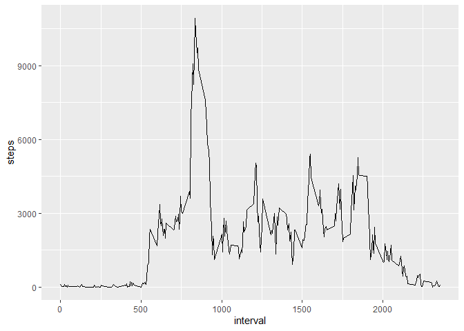
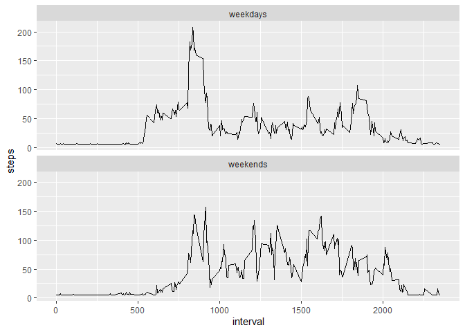

Introduction
------------

It is now possible to collect a large amount of data about personal
movement using activity monitoring devices such as a Fitbit, Nike
Fuelband, or Jawbone Up. These type of devices are part of the
“quantified self” movement – a group of enthusiasts who take
measurements about themselves regularly to improve their health, to find
patterns in their behavior, or because they are tech geeks. But these
data remain under-utilized both because the raw data are hard to obtain
and there is a lack of statistical methods and software for processing
and interpreting the data. This assignment makes use of data from a
personal activity monitoring device. This device collects data at 5
minute intervals through out the day. The data consists of two months of
data from an anonymous individual collected during the months of October
and November, 2012 and include the number of steps taken in 5 minute
intervals each day.

Loading and preprocessing the data
----------------------------------

    # import the needful
    library(dplyr)
    library(tidyverse)
    library(ggplot2)

    # unzip and read in dataset, activity.
    if (!file.exists("activity.csv")){
    unzipped_file <- unzip("activity.zip", exdir = ".")}
    activity <- read_csv("activity.csv")

    # preview dataset
    nrow(activity)

\[1\] 17568

    ncol(activity)

\[1\] 3

The activity dataset has been loaded. There are **17568** observations
and **3** variables.

What is mean total number of steps taken per day?
-------------------------------------------------

    # Calculate the total number of steps taken each day
    total_steps <- aggregate(steps ~ date, data = activity, sum)

    # A histogram to show
    mean_gg <- ggplot(data = total_steps, aes(x = steps))+geom_histogram(binwidth = 3966.534)
    mean_tot <- mean(total_steps$steps)
    median_tot <- median(total_steps$steps)
    mean_gg

The mean total number of steps taken each day is **10766** and the
median is **10765**. We can see from the histogram that the distribution
is not completely symmetrical, a bit skewed to the left of the
distribution as also reflected in the mean being slightly higher than
the median.There are also outliers in both ends of the distribution.
Also, it is unimodal.

What is the average daily activity pattern?
-------------------------------------------

    total <- aggregate(steps ~ interval, data = activity, sum)
    timeseries <- ggplot(data = total, aes(x = interval, y = steps))+geom_line()
    timeseries

    get_max <- filter(total, steps == max(total$steps))
    get_step <- get_max[1,1]
    get_value <- get_max[1,2]

On average, across all the days in the activity dataset, the 5-minute
interval with the steps is **835** with a value of **10927**.

Imputing missing values
-----------------------

    miss <- is.na(activity)

There are **2304** number of missing values in the activity dataset.

    # create a function, fun, that computes the mean number of steps for a day.
    fun <- function(steps){
            s <- sum(steps)
            l <- length(steps)
            m <- s / l
    }
    avg <- aggregate(steps ~ date, data = activity, fun)
    m_avg <- mean(avg$steps)

    # replace na values with the computed mean
    act <- replace_na(activity$steps, m_avg)

    # create new dataset, activity_2
    activity_2 <- activity
    activity_2$steps <- act

We replace the missing values with the mean number of steps per day.

    # Calculate the total number of steps taken each day for our new dataset, activity_2
    total_steps_2 <- aggregate(steps ~ date, data = activity_2, sum)

    # A histogram to show
    mean_g2 <- ggplot(data = total_steps_2, aes(x = steps))+geom_histogram(binwidth = 3523.595)
    mean_tot2 <- mean(total_steps_2$steps)
    median_tot2 <- median(total_steps_2$steps)
    mean_g2

We have a more symmetric distribution as both the mean and median have
the same values.

Are there differences in activity patterns between weekdays and weekends?
-------------------------------------------------------------------------

    # Change date format to define "weekends" and "weekdays" levels
    activity_2$date <- weekdays(activity_2$date)

    # Create a function, sec, that groups days into the defined levels
    sec <- function(date){
    if (date %in% c("Monday", "Tuesday", "Wednesday", "Thursday", "Friday")){
            weektype <- "weekdays"
    }
            else{
                    weektype <- "weekends"
            }
    }

    # Create a column, weektype
    activity_2 <- mutate(activity_2, weektype = "")
    activity_2$weektype <- factor(sapply(activity_2$date, sec))

    # Group our dataset by the weektype
    total_2 <- aggregate(steps ~ interval + weektype, data = activity_2, fun)
    weekdays <- ggplot(data = total_2, aes(x = interval, y = steps))+geom_line()+facet_wrap(~weektype, dir = "v", shrink = F)
    weekdays

Observations
------------

-   On weekdays, the average number of steps for every 5 minute interval
    before the 1000 minute time interval is higher than the average
    number of steps on weekends.
-   On weekdays, the average number of steps for every 5 minute interval
    before the 1000 minute time interval is lower than the average
    number of steps on weekends.
-   Weekdays have a peak of about 205 average number of steps which is a
    lot higher than the peak average number of steps on weekends, 155.
